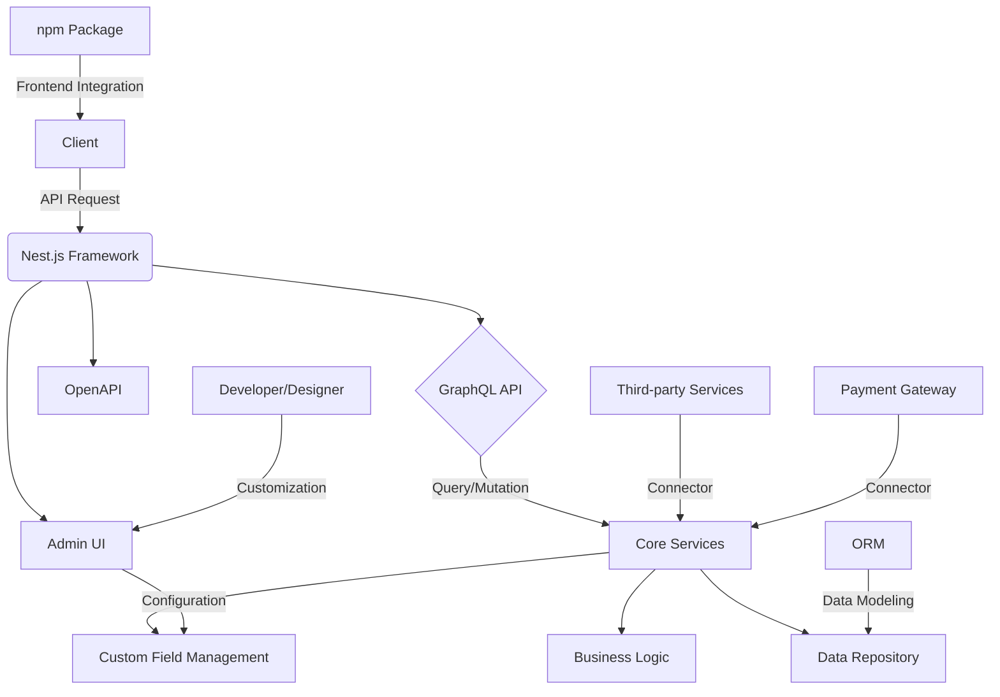

# 🛍️ShopOS - Ecommerce API Operating System

---
This is the Admin Dashboard of ShopOS build with Nest.js and Next.js

## Architecture

## Project Overview
Developed a customizable Ecommerce Operating System to address the needs of store managers using fixed platforms who want to leverage accumulated data for new feature development as their businesses grow. The project aimed to create a SaaS solution that implements the concept of an Operating System, allowing customization by specialized users such as developers and designers.

## Key Features
- Nest.js-based ecommerce framework, installable via NPM
- Includes ecommerce backend business logic, data repositories, OpenAPI, Administration UI, and GraphQL playground
- Incorporates ORM concepts to serve GraphQL APIs based on user-customized data models added through the UI

## Technical Implementation
- Created an API that serves custom fields in addition to fixed columns as GraphQL structures
- Developed an admin page for easy configuration of custom fields
- Implemented core services with immediate GraphQL serving of custom data fields configured in the admin interface
- Provided a frontend development package via npm for instant API integration
- Designed a modular structure using connectors, allowing flexible implementation of 3rd party providers (e.g., PG providers) adhering to specified standards

## Achievements
- Scalable APIs capable of handling growing business needs
- Reliable and customizable business backend systems
- Efficient and effective data repositories
- Well-designed external service connectors
- Customizable Headless Commerce Backend Operating System

## Technologies Used
- Nest.js
- GraphQL
- Node.js (NPM)
- ORM concepts
- OpenAPI
- Frontend development tools
